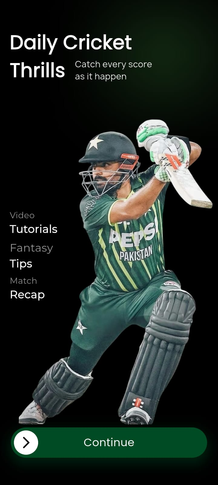
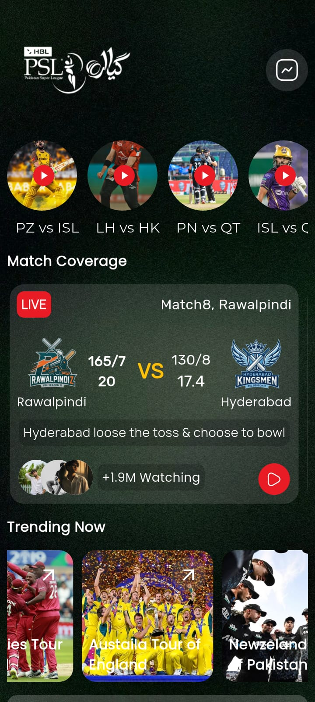
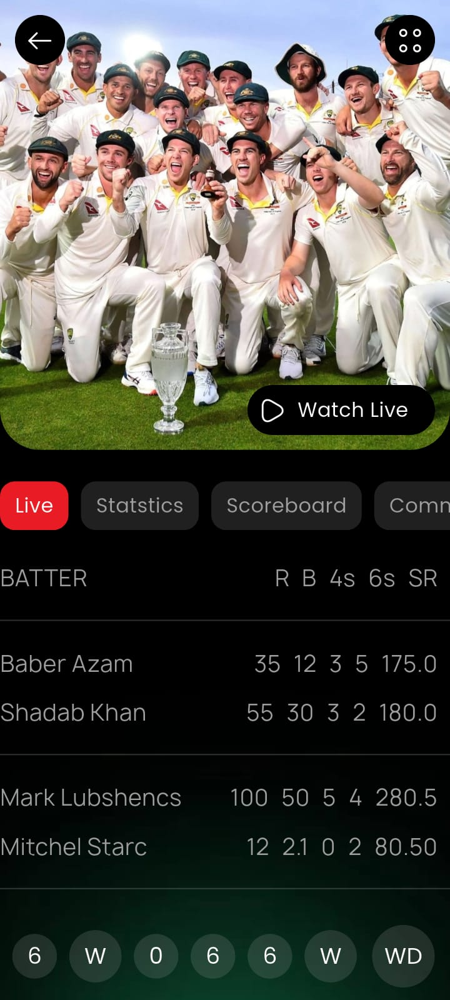

# 🏏 ScoreHunt — PSL Cricket Live Score App

A Flutter-based PSL cricket score app with live match cards, scoreboard stats, and story-style match highlights. Built with clean architecture and real product-level UI.

> ⚠️ Note: Demo data used — not connected to live API yet. Live cricket API integration coming soon.

---

## 📱 Screenshots


 -->
 -->
 -->

---

## ✨ Features

- 🟠 **Slide to Continue** — Custom swipe onboarding using `action_slider`
- 🌫️ **Glassmorphism** — `ImageFilter.blur` for frosted glass intro effect
- 📊 **Live Match Cards** — Team logos, scores, overs, toss info, viewer count
- 📖 **Story Row** — Instagram-style match highlight stories
- 📋 **Scoreboard Screen** — Batting stats: R, B, 4s, 6s, SR per player
- 📈 **Tab Navigation** — Live, Statistics, Scoreboard, Commentary, Animations
- 🔥 **Trending Section** — Current international cricket tours
- 🎟️ **Book Ticket CTA** — PSL Season 11 ticket booking button
- 🖼️ **WebP Assets** — Optimized images throughout

---

## 🏗️ Architecture

```
lib/
  src/
    constants/         # AppColors, AppSizes, AppTextStyles
    data/
      model/           # StatModel, MainCardData, StoryData, TrendingData
    presentation/
      screens/
        home/
          pages/       # Homepage
          widgets/     # Header, StoryRow, MainCardWidget, BottomCard
        stat/
          pages/       # StatsPage
          widgets/     # HeaderSection, CenterButtons, ScoreboardData
        onboard/
          pages/       # OnboardPage
          widgets/     # ColumnWidget
```

---

## 📦 Packages Used

| Package | Purpose |
|---|---|
| `action_slider` | Swipe-to-continue onboarding |
| `iconsax` | Modern icon set |
| `gap` | Clean spacing |
| `dart:ui` | ImageFilter.blur glassmorphism |

---

## 🔮 Coming Soon

- [ ] Live cricket API integration (CricAPI / RapidAPI)
- [ ] Firebase real-time score updates
- [ ] Push notifications for match events
- [ ] Player profile pages
- [ ] Fantasy team builder

---

## 🚀 Getting Started

```bash
git clone https://github.com/dartrox404/scorehunt-app.git
flutter pub get
flutter run
```

---

## 👨‍💻 Author

**Arslan Javed** — Flutter Developer  
📧 arslanjaved57420@gmail.com  
🔗 [LinkedIn](https://linkedin.com/in/arslan-javed-060aaa35b)  
🐙 [GitHub](https://github.com/dartrox404)

---

## 📄 License

MIT License
